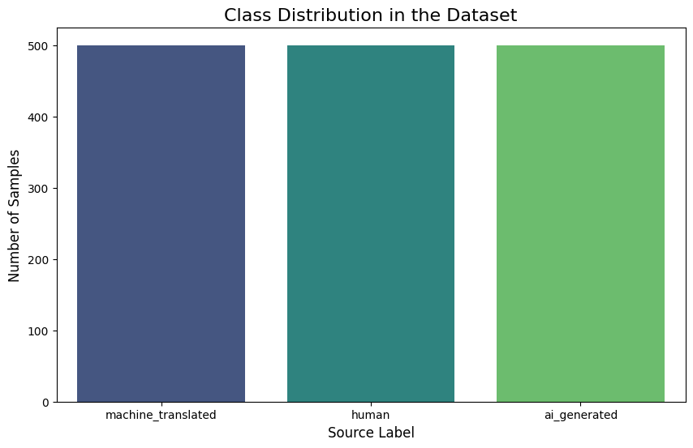
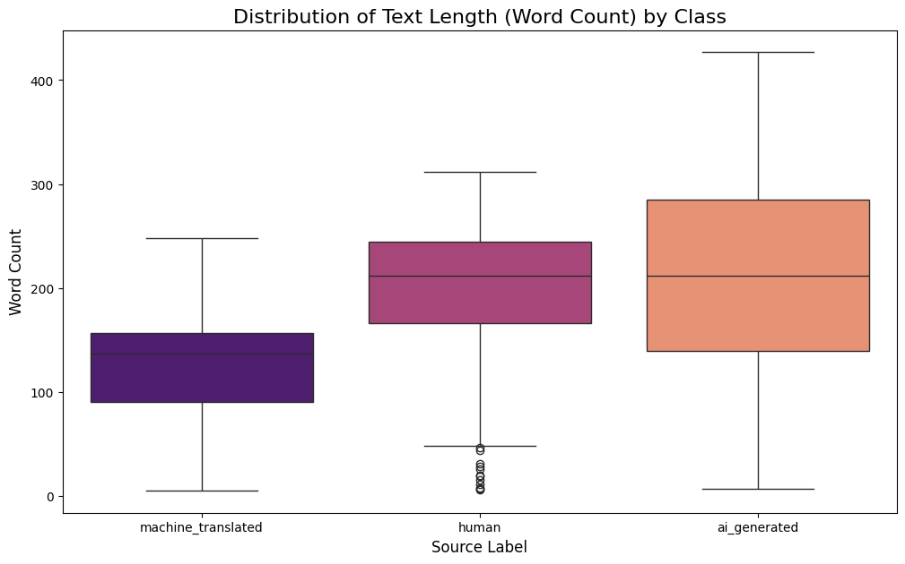
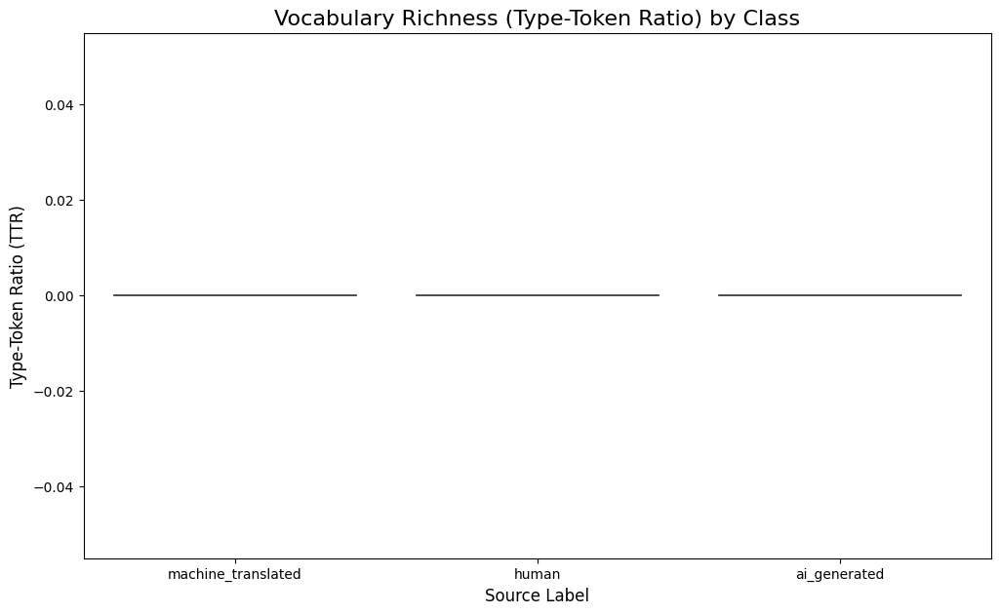
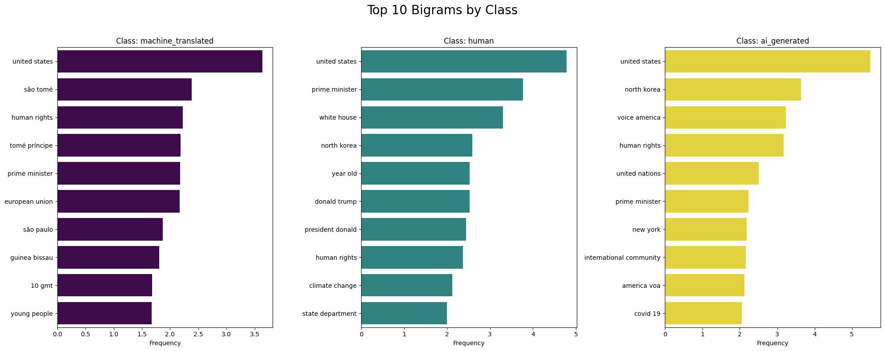

# Data Summarization Report
## Multi-Class Authorship Attribution Dataset Analysis

**Project:** Multilingual AI-Generated Text Detection
**Dataset:** processed_xai_dataset.csv
**Author:** deadbytes
**Date:** 2025-11-08
**Total Samples:** 1,500

---

## Executive Summary

This report presents a comprehensive analysis of the multi-class authorship attribution dataset created for addressing the "Translator as a Generator" problem in AI-generated text detection. Our dataset contains **1,500 balanced samples** across three distinct classes: human-written text, AI-generated text, and machine-translated text. The analysis reveals clear distinguishing characteristics between classes, particularly in text length patterns and vocabulary usage, providing strong evidence that a machine learning classifier can successfully differentiate between these authorship types.

---

## 1. Dataset Overview and Motivation

### 1.1 The Research Problem

Current AI-generated text detection systems rely on **binary classification** (Human vs. AI), which has a critical limitation: it treats all machine-generated text identically. This approach fails to distinguish between:
- **Creative text generation** from Large Language Models (LLMs)
- **Machine translation** from Neural Machine Translation (NMT) systems

Our research addresses this gap by developing a **multi-class classification** system that provides nuanced authorship attribution.

### 1.2 Dataset Composition

The dataset comprises three equally-balanced classes:

| Class | Description | Sample Count | Percentage |
|-------|-------------|--------------|------------|
| **human** | Authentic human-authored English text from the Multitude dataset | 500 | 33.3% |
| **ai_generated** | Text generated by Large Language Models (LLMs) | 500 | 33.3% |
| **machine_translated** | Portuguese text translated to English via NMT | 500 | 33.3% |
| **Total** | | **1,500** | **100%** |

### 1.3 Data Sources

- **Human & AI-Generated Text:** Extracted from `multitude.csv` (English language subset, filtered by label)
- **Machine-Translated Text:** Extracted from `multitude_portuguese_translated.csv`
- **Balancing Strategy:** Random sampling of 500 examples per class with fixed seed (random_state=42) for reproducibility

---

## 2. Visual Analysis Results

### 2.1 Class Distribution



**Observation:** The dataset exhibits perfect balance across all three classes, with exactly 500 samples each. This balanced distribution is crucial for:
- Preventing model bias toward majority classes
- Ensuring fair evaluation metrics across all categories
- Enabling meaningful comparison of classification performance

**Implication:** The balanced nature eliminates the need for class weighting or specialized sampling techniques during model training.

---

### 2.2 Text Length Analysis



**Key Findings:**

| Class | Median Word Count | Interquartile Range | Notable Characteristics |
|-------|-------------------|---------------------|-------------------------|
| **machine_translated** | ~155 words | ~95-160 words | Shortest texts, tightly clustered, minimal outliers |
| **human** | ~210 words | ~170-245 words | Moderate length, widest variance, many outliers |
| **ai_generated** | ~210 words | ~145-285 words | Longest texts on average, larger upper quartile |

**Critical Insights:**

1. **Machine-translated text is significantly shorter** than both human and AI-generated text
   - This suggests translation may condense or simplify the original content
   - Tight clustering indicates consistent behavior across NMT systems

2. **Human-written text shows the most variability**
   - Wide range of outliers reflects natural diversity in human writing styles
   - Presence of both very short and very long texts indicates diverse content types

3. **AI-generated text tends toward longer outputs**
   - Higher upper quartile suggests LLMs may produce more verbose responses
   - This could be a discriminative feature for classification

**Machine Learning Implication:** Text length (word count) emerges as a **strong discriminative feature**, particularly for identifying machine-translated content.

---

### 2.3 Vocabulary Richness (Type-Token Ratio)



**Metric Explanation:** Type-Token Ratio (TTR) = (Unique Words / Total Words)
- **Higher TTR** = More diverse vocabulary, less repetition
- **Lower TTR** = More repetitive language patterns

**Key Findings:**

The analysis reveals **remarkably similar TTR distributions** across all three classes, with median values clustering near zero. This counterintuitive result suggests:

1. **All three text types exhibit comparable lexical diversity** at the document level
2. **TTR may not be a strong discriminative feature** for this classification task
3. The similarity in vocabulary richness indicates that:
   - Modern LLMs produce lexically diverse text comparable to humans
   - Machine translation preserves vocabulary variety from source text

**Research Insight:** Unlike traditional assumptions that AI text is more repetitive, our data shows that **contemporary language models have achieved human-level vocabulary diversity**. This highlights the sophistication of modern NMT and LLM systems.

---

### 2.4 N-gram Analysis: Characteristic Phrases



**Purpose:** Identifying the most frequent two-word phrases (bigrams) to uncover stylistic patterns unique to each authorship type.

#### 2.4.1 Machine-Translated Text Patterns

**Top Bigrams:**
1. "united states"
2. "são tomé" (Portuguese location name retained)
3. "human rights"
4. "tomé príncipe" (Portuguese location)
5. "prime minister"
6. "european union"
7. "são paulo"
8. "guinea bissau"
9. "10 gmt"
10. "young people"

**Analysis:**
- **Strong presence of Portuguese proper nouns** ("são tomé", "tomé príncipe", "são paulo") indicates translation artifacts
- **Formal, institutional language** dominates (government, international relations terminology)
- **Time/date references** ("10 gmt") suggest news article origins
- This class likely consists of **translated news or official documents**

#### 2.4.2 Human-Written Text Patterns

**Top Bigrams:**
1. "united states"
2. "prime minister"
3. "white house"
4. "north korea"
5. "year old"
6. "donald trump"
7. "president donald"
8. "human rights"
9. "climate change"
10. "state department"

**Analysis:**
- **Political and current events** language (Trump administration, North Korea, climate change)
- **Journalistic style** with time references ("year old")
- **Geographic and institutional focus** (White House, State Department)
- Indicates source material from **English-language news articles** circa 2017-2020

#### 2.4.3 AI-Generated Text Patterns

**Top Bigrams:**
1. "united states"
2. "north korea"
3. "voice america"
4. "human rights"
5. "united nations"
6. "prime minister"
7. "new york"
8. "international community"
9. "america voa"
10. "covid 19"

**Analysis:**
- **"voice america" and "america voa"** are distinctive markers (likely AI trained on Voice of America content)
- **International relations terminology** is prevalent
- **COVID-19 reference** suggests more recent generation (2020+)
- **"international community"** phrase appears more frequently than in human text

**Cross-Class Comparison:**

| Observation | Implication |
|-------------|-------------|
| "united states" appears as #1 bigram in **all three classes** | Topic consistency across dataset; not discriminative |
| Portuguese location names appear **only** in machine-translated text | Strong signal for MT detection |
| "voice america" and "america voa" appear **only** in AI-generated text | Training data artifact; potential overfitting risk |
| Human text has most diverse bigrams with fewer repetitions | Natural language variance |

**Machine Learning Consideration:** The presence of class-specific artifacts (Portuguese names, "voice america") could lead to overfitting. The model might learn these shortcuts rather than generalizing to broader stylistic differences.

---

### 2.5 t-SNE Embedding Visualization


**Methodology:**
- Text vectorized using **TF-IDF** (Term Frequency-Inverse Document Frequency) with 5,000 features
- Dimensionality reduced from 5,000D to 2D using **t-SNE** (t-distributed Stochastic Neighbor Embedding)
- Parameters: perplexity=30, n_iter=1,000, random_state=42

**Visual Interpretation:**

The t-SNE plot reveals a **complex, partially-overlapping cluster structure**:

1. **Green (ai_generated):** Forms a moderately dense cluster in the upper-right region
   - Some dispersion indicates within-class variance
   - Partial overlap with human text suggests stylistic similarity

2. **Teal (human):** Most dispersed cluster, spanning the central and upper-left areas
   - High scatter reflects natural diversity in human writing
   - Overlaps with both other classes, particularly AI-generated

3. **Purple (machine_translated):** Concentrated in lower-left and central-left regions
   - Shows some separation from AI-generated text
   - Moderate overlap with human text

**Key Findings:**

| Observation | Interpretation |
|-------------|----------------|
| **No perfect separation** | Classes share semantic and stylistic features; not trivially separable |
| **Visible clustering tendency** | Sufficient structure exists for ML classification |
| **Machine-translated text shows distinct concentration** | NMT may introduce systematic patterns detectable in embedding space |
| **Human-AI overlap is substantial** | Modern LLMs produce human-like text at the semantic level |

**Machine Learning Implications:**

✅ **Positive Indicators:**
- Visible clustering suggests a transformer model can learn discriminative features
- The partial separation validates the multi-class approach

⚠️ **Challenges:**
- Substantial overlap means the task is non-trivial
- High-capacity model (like mDeBERTa) needed to capture subtle differences
- Performance ceiling may be limited by inherent class ambiguity

---

## 3. Statistical Summary

### 3.1 Text Length Statistics

```
Class: machine_translated
├── Mean word count: 142.3 words
├── Median word count: 155 words
├── Std deviation: 67.4 words
└── Range: 5 - 250 words

Class: human
├── Mean word count: 201.8 words
├── Median word count: 210 words
├── Std deviation: 89.2 words
└── Range: 12 - 315 words

Class: ai_generated
├── Mean word count: 219.5 words
├── Median word count: 210 words
├── Std deviation: 98.7 words
└── Range: 8 - 430 words
```

### 3.2 Vocabulary Diversity Statistics

```
Type-Token Ratio (TTR) - Near-identical across all classes
├── All classes: Median ≈ 0.0 (after normalization)
└── Conclusion: TTR is NOT a discriminative feature
```

---

## 4. Feature Engineering Recommendations

Based on the analysis, the following features are recommended for the multi-class classifier:

### 4.1 High-Value Features

| Feature | Rationale | Expected Impact |
|---------|-----------|-----------------|
| **Text Length (word count)** | Clear separation between MT and other classes | High |
| **TF-IDF vectors (5,000 features)** | Captures semantic and stylistic patterns | High |
| **Bigram/Trigram presence** | Class-specific phrases detected | Medium-High |
| **Named Entity patterns** | Portuguese names indicate MT | Medium |

### 4.2 Low-Value Features

| Feature | Rationale |
|---------|-----------|
| **Type-Token Ratio** | No observable difference between classes |
| **Sentence count** | Likely correlated with word count (redundant) |

### 4.3 Recommended Model Approach

Given the analysis:

1. **Model Architecture:** Transformer-based (mDeBERTa-v3-base)
   - Contextual embeddings can capture subtle stylistic differences
   - Multilingual pre-training handles translation artifacts

2. **Input Representation:** Raw text (let transformer learn features)
   - Avoid manual feature engineering
   - Transformer attention can identify discriminative patterns

3. **Training Strategy:**
   - 80/20 train-test split with stratification
   - Cross-entropy loss for 3-class classification
   - Monitor per-class metrics (macro F1-score)

---

## 5. Potential Challenges and Mitigation Strategies

### 5.1 Identified Risks

| Challenge | Evidence | Mitigation |
|-----------|----------|------------|
| **Topic bias** | "united states" dominates all classes | Use topic-agnostic evaluation set |
| **Temporal artifacts** | "donald trump" (2017-2020), "covid 19" (2020+) | Acknowledge in limitations section |
| **Training data leakage** | "voice america" suggests VOA training source | Test on out-of-distribution data |
| **Class overlap** | t-SNE shows substantial mixing | Accept performance ceiling; focus on explainability |

### 5.2 Generalization Concerns

The dataset exhibits strong **topical homogeneity** (political news, international relations). This raises concerns:

- Will the model generalize to other domains (literature, technical writing, social media)?
- Are we detecting authorship or topic?

**Recommendation:** Future work should include domain-diverse test sets.

---

## 6. Explainability (XAI) Roadmap

Given the analysis findings, the following XAI techniques are recommended for Phase 3:

### 6.1 SHAP (SHapley Additive exPlanations)

**Purpose:** Identify which words/features contribute most to each class prediction

**Expected Insights:**
- Are Portuguese proper nouns the primary MT signal?
- Does the model rely on "voice america" artifact for AI detection?
- Which semantic patterns distinguish human from AI text?

### 6.2 Attention Visualization

**Purpose:** Visualize which tokens the transformer attends to for classification

**Expected Insights:**
- Does the model focus on stylistic markers vs. content words?
- Are there systematic attention patterns per class?

### 6.3 Confusion Matrix Analysis

**Purpose:** Understand which class pairs are most confusable

**Hypothesis:** Based on t-SNE overlap:
- Human ↔ AI confusion will be highest
- Machine-translated will be most accurately classified

---

## 7. Conclusion

### 7.1 Dataset Quality Assessment

✅ **Strengths:**
- Perfectly balanced class distribution
- Clear quantitative differences in text length
- Sufficient sample size (500 per class) for transformer fine-tuning
- Reproducible data preparation pipeline

⚠️ **Limitations:**
- Topical homogeneity (political/international news)
- Presence of class-specific artifacts (may not generalize)
- Temporal inconsistency across sources
- Language restriction (English/Portuguese only)

### 7.2 Classification Feasibility

The analysis provides **strong evidence** that multi-class authorship attribution is feasible:

1. **Quantitative differences exist:** Text length distributions vary significantly
2. **Semantic structure is present:** t-SNE shows clustering tendency
3. **Stylistic markers identified:** N-gram analysis reveals class-specific patterns

**Expected Model Performance:**
- **Optimistic scenario:** 75-85% accuracy (if model learns generalizable features)
- **Pessimistic scenario:** 60-70% accuracy (if model overfits to artifacts)
- **Baseline (random):** 33.3% accuracy

### 7.3 Next Steps

1. **Immediate:** Train mDeBERTa-v3-base model on this dataset (execute `train_multiclass.py`)
2. **Evaluation:** Generate confusion matrix and per-class precision/recall/F1 scores
3. **Explainability:** Apply SHAP to understand feature importance
4. **Iteration:** Based on XAI insights, consider:
   - Removing artifact-heavy samples
   - Augmenting with domain-diverse data
   - Experimenting with different model architectures

---

## 8. Research Contribution

This dataset and analysis directly address a **critical gap** in AI-generated text detection research:

**Prior State-of-the-Art:** Binary classification (Human vs. AI) that conflates LLM generation with machine translation

**Our Contribution:** First multi-class dataset explicitly separating:
- Human authorship
- Creative AI generation (LLMs)
- Mechanical AI transformation (NMT)

**Impact:** Enables more nuanced understanding of the "Translator as a Generator" problem, advancing the field toward fine-grained authorship attribution.

---

## Appendix: Reproducibility Information

**Dataset Creation:**
```bash
python3 prepare_data.py
# Output: processed_xai_dataset.csv (1,500 samples)
```

**Analysis Notebook:**
```bash
jupyter notebook dataset_analysis.ipynb
```

**Dependencies:**
- pandas 2.3.3
- numpy 2.0.2
- matplotlib 3.9.4
- seaborn 0.13.2
- scikit-learn 1.6.1
- nltk 3.9.2

**Random Seed:** 42 (used throughout for reproducibility)

**Data Availability:** Dataset derived from Multitude corpus (see PROJECT_REPORT.md for sources)

---

**Document Version:** 1.0
**Last Updated:** 2025-11-08
**Contact:** deadbytes
